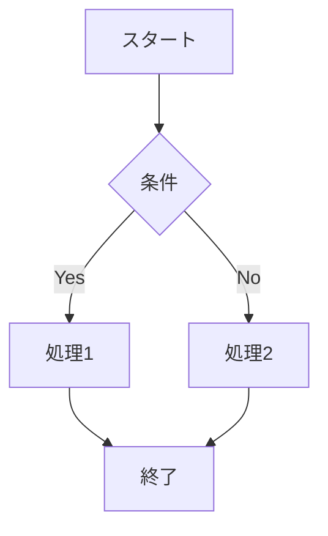

# zkFutureDiary
No more need for the hassle of creating schedules for goal achievement.<br>
From now on, all you need to do is enter your goals.<br>
AI will automatically create a schedule for you, and all you have to do is follow it to achieve your goals.<br>
Zero-knowledge proofs ensure your privacy while reliably proving goal achievement.<br>
This is "zkFutureDiary." Let's dive into the future you've designed!<br>

<br>

## Recommended Environment
PC: Latest version of Brave<br>

## Prerequisites
Auro Wallet must be installed

## How to Use
### ① Create a Schedule
Enter your goal in the input box on the left and press the generate button.<br>

### ② View the Schedule
You can view the schedule that has been generated.<br>

### ③ Verify
Use the current time, location, and camera function to prove that you have indeed achieved what is outlined in your Future Diary.<br>
Verification can be done while protecting your privacy through zero-knowledge proofs.<br>
Example:<br>
If the schedule says "Go to a cafe at 14:00," the following three points are verified:<br>
・The current time is 14:00<br>
・Current location is included in the list of cafe locations<br>
・The photo taken with the camera function is indeed in a cafe<br>

### ④ Share
Share your success in achieving your Future Diary goals with X<br>
Zero-knowledge proofs allow you to confidently showcase your achievements!<br>

"My goal was to 'find a cool cafe.'"
"Today, I achieved my goal of going to a cafe at 14:00."
"It was reliably proven through zero-knowledge proofs."
7mX2W8KgizCD8PjhMV2KpG1vw94S3NroAg5H3e3hu9JGVQsL4ZQFPixpfT6U1K2qamj3q1u1DXj1MzqHjB1oJ1uHuJ1LgGzf

### Options
### A Image Generation
You can generate an image for a random hour of your schedule.<br>

# Technical Information
### GoogleMap API
Used for location verification

### OpenAI API
Used for schedule creation, and processing submitted images

### StableDiffusion API
Used for generating images of the schedule

# zk未来日記
目標達成のための面倒なスケジュール作成はもう必要ありません。<br>
これからは、あなたが目標を入力するだけでOK。<br>
AIが自動的にスケジュールを作成し、それに沿って行動するだけで目標が達成できます。<br>
ゼロ知識証明によりプライバシーを守りつつ、目標達成が確実に証明されます。<br>
それが「zk未来日記」。さあ、デザインされた未来へ飛び込みましょう！<br>


## 推奨環境
PC: Brave最新版<br>

## 動作前提
Auro Walletがインストールされていること

## 使い方
### ユーザー
#### ①スケジュールを作る
左の入力ボックスに、目標を入力して生成ボタンを押します。<br>
#### ②スケジュールを見る
生成されたスケジュールを見ることができます。<br>
#### ③検証する
現在の時間、位置、カメラ機能を使って、未来日記を確かに達成したことを証明します。<br>
ゼロ知識証明によって、プライバシーを守りながら検証できます。<br>
例）<br>
スケジュールが「14:00にカフェに行く」の場合、下記の3点を検証<br>
・現在の時間が14:00であること<br>
・現在の位置情報がカフェの位置情報一覧に含まれる<br>
・カメラ機能で撮影した写真がカフェであること<br>
#### ④共有する
未来日記を確かに達成できたことをXにシェアしましょう<br>
ゼロ知識証明によって、確実に達成したことがわかるため、自慢できます！<br>
```
私の目標は、「渋いカフェを見つけること」です
今日私は、14:00にカフェに行くを達成しました
ゼロ知識証明によって確実に証明されました
7mX2W8KgizCD8PjhMV2KpG1vw94S3NroAg5H3e3hu9JGVQsL4ZQFPixpfT6U1K2qamj3q1u1DXj1MzqHjB1oJ1uHuJ1LgGzf
```

### オプション
#### A 画像生成
スケジュールのランダムな1時間に対して画像を作ることができます。<br>

# 技術情報
### GoogleMapAPI
位置情報の検証に使用
### OpenAIAPI
スケジュールの作成、投稿した画像に使用
### StableDiffusionAPI
スケジュールの画像の生成に使用


